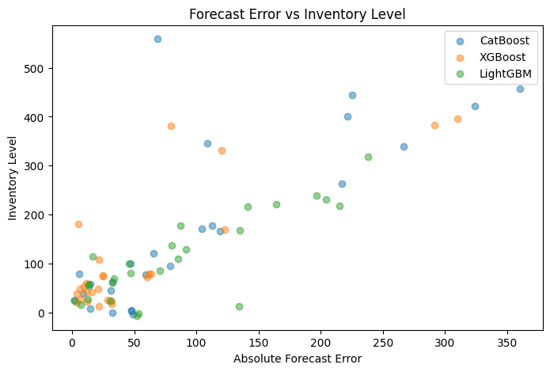
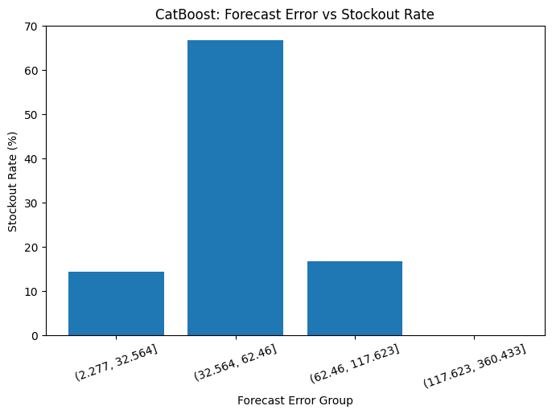
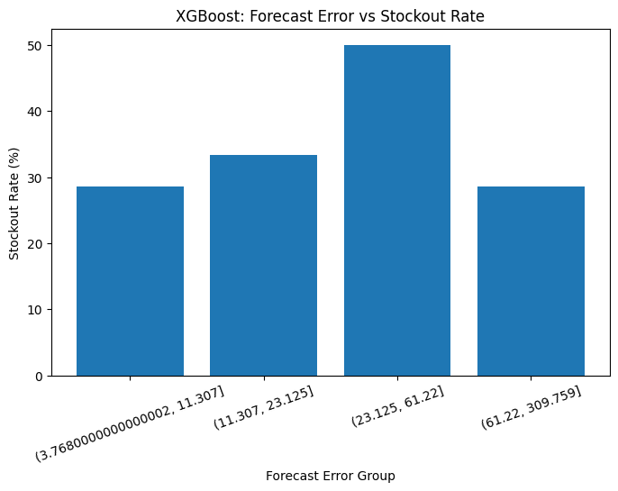
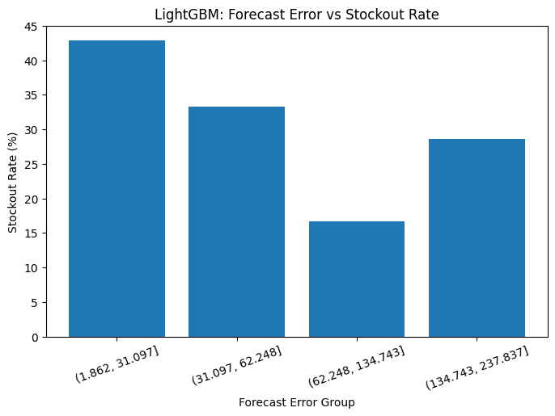

# 예측 오차가 실제 재고 수준과 품절 위험에 어떤 영향을 미치는가?

## 가설

### H1. 
수요예측 오차가 클수록 필요한 재고 수준이 증가할 것이다.

### H2. 
수요예측 오차가 클수록 품절 위험이 증가할 것이다.

### H3. 
예측 성능이 우수한 모델이 항상 재고 운영 성과가 우수한 것은 아닐 것이다.

## 분석 방법

| 단계 | 분석 내용 | 검증 가설 |
|---|---|---|
| 수요 데이터 구축 | 거래 데이터를 SKU별 일 단위 수요로 집계 | - |
| 수요예측 | CatBoost, XGBoost, LightGBM으로 수요 예측 및 예측 오차 산출 | - |
| 재고 수준 분석 | 예측 오차에 따른 재고 수준 변화 분석 | H1 |
| 품절 위험 분석 | 예측 오차에 따른 품절 위험 변화 분석 | H2 |
| 모델별 비교 | 모델별 예측 성능과 재고 운영 결과 비교 | H3 |

## 사용 데이터

### 데이터 출처

**[UCI Machine Learning Repository - Online Retail](https://archive.ics.uci.edu/dataset/352/online+retail)**

영국 온라인 소매업체의 2010년 12월부터 2011년 12월까지의 거래 데이터를 사용하였다.

### 주요 데이터

| 구분 | 주요 변수 | 설명 |
|---|---|---|
| 상품 | StockCode | 상품 식별자 |
| 거래일시 | InvoiceDate | 거래 발생 일시 |
| 판매수량 | Quantity | 거래 수량 |
| 단가 | UnitPrice | 상품 단가 |
| 거래번호 | InvoiceNo | 거래 식별자 |
| 고객 | CustomerID | 고객 식별자 |

### 데이터 전처리

원천 거래 데이터를 다음과 같이 변환하였다.

```
거래 데이터
    ↓
취소·반품 거래 처리
    ↓
SKU × 날짜 단위 집계
    ↓
일별 판매량 생성
    ↓
주별 판매량 생성
    ↓
수요예측 데이터 구축
```

### 분석 대상 선정

SKU가 많아 다음과 같은 조건에 해당하는 SKU 3개를 임의 선정하였다

```
- 판매량이 0인 비율이 30% 미만
- 40주 이상의 판매 기록 존재
- 평균 주간 판매량이 5 단 이상
```

- SKU: 10135, 11001, 15034

## 분석 결과

### H1. 수요예측 오차가 클수록 필요한 재고 수준이 증가할 것이다.



- 3개의 예측 모델 모두 절대 오차가 클수록 재고 수준도 증가하는 경향이 확인되었다
- 수요 예측이 **불확실**할수록 재고 운영에 필요한 **완충 수준도 증가**할 수 있음을 확인하였다

### H2. 수요예측 오차가 클수록 품절 위험이 증가할 것이다.

<p align='center'>
    
    
    
</p>

- 예측 오차의 크기만으로 품절 위험을 설명하기는 어렵다
- 3개의 모델 모두 예측 오차가 커질수록, 품절 위험이 계속 증가하는 패턴은 보이지 않는다
- CatBoost와 XGBoost는 중간 수준의 예측 오차 구간에서 품절 위험이 가장 높게 나타났으나, 

    점차 떨어지는 **비선형 패턴**을 보인다

- 수요 규모나 SKU별 특성 등의 **다른 요인의 영향을 함께 고려**할 필요가 있다

### H3. 예측 성능이 우수한 모델이 항상 재고 운영 성과가 우수한 것은 아닐 것이다.

| 모델       |    MAE |    품절 위험(품절률) |    초과재고 |
| -------- | -----: | -----: | ------: |
| CatBoost | 102.57 | 23.08% | 3051.20 |
| XGBoost  |  54.02 | 34.62% | 1351.99 |
| LightGBM |  84.85 | 30.77% | 1857.24 |

- CatBoost는 MAE(예측 오차)가 가장 높지만, 품절 위험은 세 모델 중 가장 낮다
- XGBoost는 MAE가 가장 낮았지만, 품절 위험은 세 모델 중 가장 높다
- 오차가 작을수록 **초과재고는 낮은** 경향은 확인할 수 있다
- 예측 정확도가 높다고 해서 품절과 초과재고를 **동시에 낮추지는 않는다**

## 인사이트

```
좋은 수요예측 모델은 단순히 오차가 작은 모델이 아니라, 재고 운영 목적에 맞는 모델이어야 한다
```

### 1. 예측 오차가 큰 상품일수록 재고 완충 수준을 별도로 고려할 필요가 있다

H1에서 세 모델 모두 예측 **오차가 클수록** **재고 수준이 높아**지는 경향을 보임

### 2. 예측 오차를 줄이는 것만으로 품절 위험을 해결하기는 어렵다

예측 오차가 증가할수록 품절 위험이 **일관되게 증가하지 않았다**

품절은 예측 오차보다 수요 규모, SKU 별 특성 등과 같은 다른 요인과 함께 발생

### 3. 수요예측 모델은 정확도뿐만 아니라 재고 운영 지표를 함께 평가해야 한다

예측 정확도가 높은 모델을 선택하는 것과 실제 재고 운영 성과가 좋은 모델을 선택하는 것은 동일하지 않다

## 한계점
- 예측 수요 + 안전재고(예측 수요의 20%)로 산출한 **시뮬레이션**이므로, 실제와는 상이할 수 있다
- **안전 재고 비율을 고정**적으로 설정하여 실제 기업의 리드타임, 서비스 수준, 수요 변동성을 반영하지 못하였다
- 공급 관련 변수가 없어, 품절 발생 원인은 직접 설명하지 못 하였다
